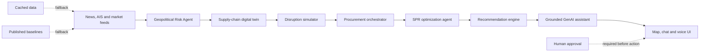

# HormuzShield AI

> AI-driven energy supply-chain resilience for import-dependent economies.

HormuzShield AI is a working prototype built for **Problem Statement 2: AI-driven energy supply-chain resilience for import-dependent economies** at the **ET AI Hackathon 2.0**. It helps Indian energy planners understand how a disruption at the Strait of Hormuz could affect crude-oil supply, refinery operations, procurement, and strategic petroleum reserves (SPR)—then turns that analysis into an explainable response plan.

The prototype combines live external signals, a supply-chain digital twin, deterministic scenario simulation, constrained procurement planning, SPR optimization, and a grounded GenAI assistant in one decision-support workflow.

> **Decision-support only:** HormuzShield AI never releases reserves, places orders, or moves money. Any operational or policy action requires authorized human approval.

## The problem

India imports most of the crude oil it consumes, and a large share travels through maritime chokepoints. During a geopolitical shock, decision-makers must quickly answer interconnected questions:

- Is the disruption credible, and which routes are affected?
- Which refineries and suppliers are exposed?
- How large is the daily supply gap?
- Which alternative crude grades are compatible with affected refineries?
- Can strategic reserves bridge the delay until replacement cargoes arrive?

These questions are often evaluated across disconnected news feeds, vessel data, market terminals, spreadsheets, and static reports. That slows response time and makes recommendations difficult to audit.

## Our solution

HormuzShield AI converts live and reference data into one traceable recommendation:

1. **Monitor** geopolitical news, tanker activity, congestion, oil prices, and freight stress.
2. **Score** disruption risk for each shipping route.
3. **Traverse** a digital twin connecting suppliers, routes, refineries, and SPR sites.
4. **Simulate** refinery losses, national supply gaps, and indicative price effects.
5. **Reallocate** compatible alternative supply under capacity and transit-time constraints.
6. **Optimize** an advisory SPR bridge plan and explicitly flag infeasibility.
7. **Explain** the result through a map-based, voice-enabled GenAI assistant grounded in the latest pipeline output.

## Why it is different

- **Chokepoint-aware modeling:** a Hormuz event disables every modeled lane through the strait, preventing another Hormuz-dependent supplier from being presented as a safe alternative.
- **Operational compatibility:** procurement recommendations check API gravity, sulfur tolerance, supplier headroom, route availability, and lead time.
- **Graph-based exposure:** the digital twin supports multi-hop analysis from route to refinery to reserve site, and back to at-risk suppliers.
- **Graceful degradation:** every external signal is labeled `live`, `cached`, or `baseline`; the prototype remains demonstrable if a public feed is unavailable.
- **Grounded GenAI:** the assistant receives the current structured pipeline result and recent news as context, instead of inventing operational facts.
- **Human-in-the-loop safety:** reserve releases and procurement remain recommendations, never autonomous actions.

## Architecture



All pipeline stages exchange plain dataclasses from `models.py`. These form inspectable API contracts and make it possible to replace a heuristic or data provider without rewriting the whole system.

## Working prototype

### Prerequisites

- Python 3.10 or newer
- Internet access for live feeds and GenAI responses
- A Groq API key for the conversational assistant
- Optional EIA API key for the secondary oil-price source

The analytical pipeline uses only the Python standard library. No package installation is required.

### Setup

```bash
git clone https://github.com/ajmani-x/hormuz_pipeline.git
cd hormuz_pipeline
cp .env.example .env
```

Add the required key to `.env`:

```dotenv
GROQ_API_KEY=your_groq_api_key
# Optional fallback market-data provider
EIA_API_KEY=your_eia_api_key
```

Do not commit `.env` or any API key.

### Run the interactive application

```bash
python3 server.py
```

Open [http://127.0.0.1:8765](http://127.0.0.1:8765). The server first warms the data cache, then refreshes it every 90 seconds.

Suggested demo questions:

- “Which refineries are exposed to a Hormuz disruption?”
- “How large is the current simulated supply gap?”
- “Which alternative suppliers should we use and why?”
- “Can the SPR bridge the gap until replacement cargoes arrive?”
- “Which figures are live and which are baselines?”

### Run the analytical pipeline from the CLI

```bash
python3 main.py
python3 main.py --disruption 0.65
python3 main.py --scenario "Hormuz severe disruption" --disruption 1.0
python3 main.py --disruption 0.50 --json full_output.json
```

`--disruption` is the fraction of exposed route flow assumed lost. For example, `0.5` represents a 50% reduction. The legacy `--seed` argument is accepted for compatibility but has no effect because the data path is deterministic.

## Core user flow

1. Open the application and review the current risk, tanker, Brent, exposure, and supply-gap indicators.
2. Ask a natural-language question or use voice input.
3. Inspect the answer alongside the highlighted Indian states and live operational indicators.
4. Change the disruption percentage through `GET /api/run` or the CLI to compare scenarios.
5. Review procurement and SPR recommendations before any human decision.

## API

| Endpoint | Purpose |
|---|---|
| `GET /` | Serve the interactive map, chat, and voice interface |
| `GET /api/status` | Return cache readiness and current headline metrics |
| `GET /api/run?disruption=0.5&region=Hormuz` | Run an explicit scenario and return structured JSON |
| `POST /api/ask` | Answer a question using the latest grounded pipeline context |

Example question request:

```bash
curl -X POST http://127.0.0.1:8765/api/ask \
  -H "Content-Type: application/json" \
  -d '{"question":"Which refineries face the greatest exposure?"}'
```

## Technical implementation

| Stage | File | Implementation |
|---|---|---|
| Signal ingestion | `data_sources.py` | GDELT, AIS-derived traffic, Yahoo/EIA market data, freight proxy, caches, and cited baselines |
| Shared contracts | `models.py` | Serializable dataclasses for every pipeline stage |
| Risk intelligence | `geo_risk_agent.py` | Weighted fusion of news sentiment, AIS anomalies, and market stress |
| Digital twin | `supply_graph.py`, `digital_twin.py` | Directed multi-hop supply network and exposure traversal |
| Scenario modeling | `disruption_simulator.py` | Supply-gap, refinery-utilization, and indicative price-impact calculation |
| Procurement | `procurement_agent.py` | Greedy constrained matching by crude compatibility, capacity, route, and lead time |
| Reserve planning | `spr_agent.py` | Draw-rate and inventory-constrained advisory bridge allocation |
| Orchestration | `orchestrator.py` | End-to-end pipeline and explainable action synthesis |
| GenAI/RAG service | `server.py` | Background refresh, structured grounding, Groq inference, APIs, and chat memory |
| Experience | `agent.html` | Responsive map, live indicators, chat, speech input, and text-to-speech |

## Data provenance and resilience

Nothing in the pipeline is randomly generated. Each dynamic signal reports its quality tier:

| Signal | Live source | Fallback chain |
|---|---|---|
| News | GDELT DOC 2.0 | Last-known-good cache → dated historical events |
| Hormuz vessel activity | straits.live | Cache → cited observed baseline |
| Normal tanker volume | Rolling median of local observations | Published constant until sufficient history exists |
| Brent and WTI | Yahoo Finance | EIA with optional key → cache → published baseline |
| Freight stress | Seven-day movement of listed tanker owners | Cache → neutral baseline |
| Non-Hormuz routes | No equivalent free per-vessel feed | Published route-volume baselines |

Reference refinery capacity, supplier mix, and SPR capacity are documented in `data_sources.py`. Supplier headroom is an analytical estimate—not a public contract commitment—and Indian SPR fill levels use the latest publicly available figures because live inventory is not published.

## Responsible AI and limitations

- Risk and price-impact calculations are transparent heuristics, not trained forecasting models.
- The assistant is instructed to answer only from supplied pipeline context, but generated language must still be reviewed.
- Public feeds may be delayed, incomplete, rate-limited, or temporarily unavailable.
- The reference network does not include private contracts, refinery tank levels, hedges, cargo positions, or classified government data.
- Procurement uses greedy allocation, not a global cost optimizer.
- The prototype does not claim causal certainty or execute real-world actions.
- Persistent chat history is stored locally in `chat_history.jsonl`; production deployments should add authentication, retention controls, encryption, and user consent.

## Impact and scalability

The same architecture can support other import-dependent economies and chokepoints by replacing the reference network and regional feeds. Production evolution would include:

- paid vessel-level AIS and port data;
- ERP, contract, inventory, and cargo integrations;
- probabilistic forecasting with calibrated confidence intervals;
- cost, emissions, sanctions, insurance, and contractual constraints;
- optimization across multiple simultaneous disruptions;
- role-based access, audit logs, and formal human approval workflows;
- separately deployed agents using the existing dataclass contracts as versioned schemas.

Potential users include energy ministries, strategic reserve authorities, refiners, commodity procurement teams, shipping operators, insurers, and national emergency-response cells.

## Repository structure

```text
hormuz_pipeline/
├── agent.html                 # Primary interactive UI
├── server.py                  # Local API and grounded GenAI service
├── orchestrator.py            # End-to-end pipeline
├── data_sources.py            # Live, cached, and baseline data
├── models.py                  # Shared stage contracts
├── supply_graph.py            # Supply-network graph
├── geo_risk_agent.py          # Route-risk scoring
├── digital_twin.py            # Exposure assessment
├── disruption_simulator.py    # Scenario impact
├── procurement_agent.py       # Alternative supply allocation
├── spr_agent.py               # Reserve bridge recommendation
├── main.py                    # CLI entry point
├── sample_run.json            # Example structured result
└── .env.example               # Environment-variable template
```

## Acknowledgements

This prototype uses public data from GDELT, straits.live, Yahoo Finance, and optionally the U.S. Energy Information Administration. The conversational layer calls the Groq API using an open model. The web map uses the MIT-licensed, web-optimized boundary data from [india-official-geojson](https://github.com/AbhinavSwami28/india-official-geojson), which includes the complete Jammu & Kashmir, Ladakh/Aksai Chin, and Arunachal Pradesh extents. Detailed source notes and derivations are included alongside the relevant constants in `data_sources.py`.
